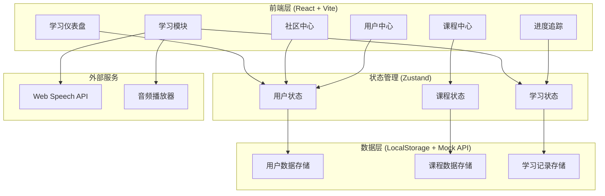
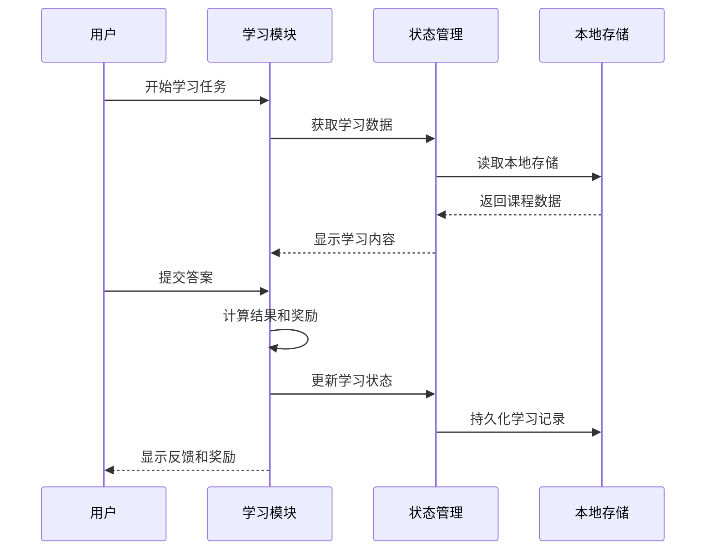
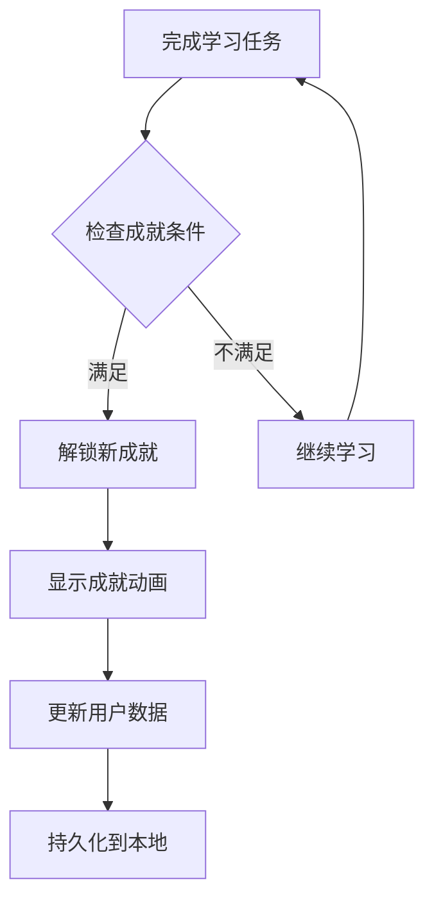

# 多语种在线教育平台 - 技术架构文档

## 1. 架构设计



## 2. 技术选型

### 前端技术栈
- **核心框架**: React 18 + TypeScript
- **构建工具**: Vite 5
- **样式方案**: Tailwind CSS 3
- **状态管理**: Zustand
- **路由管理**: React Router DOM v6
- **动画库**: Framer Motion
- **图标库**: Lucide React
- **数据可视化**: Recharts

### 数据存储方案
- **本地存储**: LocalStorage 用于用户数据、进度、设置的持久化
- **模拟API**: 使用 Mock 数据模拟后端接口响应

### 外部API集成
- **语音合成**: Web Speech API (SpeechSynthesis)
- **语音识别**: Web Speech API (SpeechRecognition)
- **音频播放**: HTML5 Audio API

## 3. 路由定义

| 路由路径 | 页面名称 | 功能描述 | 权限要求 |
|----------|----------|----------|----------|
| `/` | 首页/仪表盘 | 学习概览、快速入口 | 已登录 |
| `/login` | 登录页 | 用户登录 | 游客 |
| `/register` | 注册页 | 用户注册 | 游客 |
| `/courses` | 课程中心 | 浏览和选择课程 | 已登录 |
| `/learn/:courseId/:moduleType` | 学习模块 | 单词/语法/口语/听力练习 | 已登录 |
| `/progress` | 学习进度 | 个人数据统计和能力展示 | 已登录 |
| `/recommendations` | 个性化推荐 | 智能学习路径推荐 | 已登录 |
| `/community` | 社区中心 | 学习交流和小组讨论 | 已登录 |
| `/achievements` | 成就中心 | 徽章墙和排行榜 | 已登录 |
| `/profile` | 个人中心 | 个人资料和设置 | 已登录 |

## 4. 数据模型定义

### 4.1 用户模型 (User)

```typescript
interface User {
  id: string;
  email: string;
  username: string;
  avatar: string;
  nativeLanguage: 'zh' | 'en' | 'ja' | 'ko';
  targetLanguages: ('en' | 'ja' | 'ko')[];
  currentLevel: Record<string, Level>; // 每种语言的能力等级
  streak: number; // 连续学习天数
  totalXp: number; // 总经验值
  badges: string[]; // 已获得的徽章ID
  createdAt: string;
  lastLoginAt: string;
}
```

### 4.2 课程模型 (Course)

```typescript
interface Course {
  id: string;
  language: 'en' | 'ja' | 'ko';
  level: Level;
  title: string;
  description: string;
  coverImage: string;
  modules: Module[];
  totalLessons: number;
  estimatedHours: number;
  learnersCount: number;
}

interface Module {
  id: string;
  type: 'vocabulary' | 'grammar' | 'speaking' | 'listening';
  title: string;
  lessons: Lesson[];
}
```

### 4.3 学习记录模型 (LearningRecord)

```typescript
interface LearningRecord {
  id: string;
  odotuserId: string;
  courseId: string;
  moduleType: string;
  lessonId: string;
  score: number;
  timeSpent: number; // 秒
  completedAt: string;
  mistakes: string[]; // 错题记录
}
```

### 4.4 成就模型 (Achievement)

```typescript
interface Achievement {
  id: string;
  name: string;
  description: string;
  icon: string;
  category: 'streak' | 'level' | 'completion' | 'social';
  requirement: number;
  xpReward: number;
}
```

## 5. 能力等级体系 (CEFR 标准)

| 等级代码 | 等级名称 | 描述 | 对应能力值 |
|----------|----------|------|------------|
| A1 | 入门级 | 能理解并使用日常用语和基本句型 | 0-200 |
| A2 | 基础级 | 能理解直接关涉身边事物的句子和常用语 | 200-400 |
| B1 | 中级 | 能理解一般在工作、学习、生活等场合的标准语 | 400-600 |
| B2 | 中高级 | 能自如流畅地与母语者进行交流 | 600-800 |
| C1 | 高级 | 能有效运用语言，具备复杂的表达能力 | 800-950 |
| C2 | 精通级 | 接近母语者水平，表达自然流畅 | 950-1000 |

## 6. 核心模块设计

### 6.1 学习模块交互流程



### 6.2 成就解锁流程



## 7. 项目目录结构

```
/workspace/
├── index.html
├── package.json
├── vite.config.ts
├── tailwind.config.js
├── tsconfig.json
├── .env
├── public/
│   └── favicon.ico
├── src/
│   ├── main.tsx
│   ├── App.tsx
│   ├── index.css
│   ├── components/
│   │   ├── layout/
│   │   │   ├── Header.tsx
│   │   │   ├── Sidebar.tsx
│   │   │   └── MobileNav.tsx
│   │   ├── common/
│   │   │   ├── Button.tsx
│   │   │   ├── Card.tsx
│   │   │   ├── Modal.tsx
│   │   │   ├── ProgressBar.tsx
│   │   │   └── Toast.tsx
│   │   ├── learning/
│   │   │   ├── VocabularyCard.tsx
│   │   │   ├── GrammarExercise.tsx
│   │   │   ├── SpeakingModule.tsx
│   │   │   └── ListeningModule.tsx
│   │   ├── dashboard/
│   │   │   ├── TodayProgress.tsx
│   │   │   ├── CourseCard.tsx
│   │   │   └── AchievementBadge.tsx
│   │   └── community/
│   │       ├── PostCard.tsx
│   │       └── CommentSection.tsx
│   ├── pages/
│   │   ├── Home.tsx
│   │   ├── Login.tsx
│   │   ├── Register.tsx
│   │   ├── Courses.tsx
│   │   ├── Learn.tsx
│   │   ├── Progress.tsx
│   │   ├── Recommendations.tsx
│   │   ├── Community.tsx
│   │   ├── Achievements.tsx
│   │   └── Profile.tsx
│   ├── store/
│   │   ├── userStore.ts
│   │   ├── courseStore.ts
│   │   ├── learningStore.ts
│   │   └── achievementStore.ts
│   ├── data/
│   │   ├── courses.ts
│   │   ├── vocabulary.ts
│   │   ├── grammar.ts
│   │   └── achievements.ts
│   ├── hooks/
│   │   ├── useSpeech.ts
│   │   ├── useLocalStorage.ts
│   │   └── useProgress.ts
│   ├── utils/
│   │   ├── formatters.ts
│   │   └── storage.ts
│   └── types/
│       └── index.ts
└── README.md
```

## 8. 性能优化策略

### 8.1 代码层面优化
- 使用 React.memo 避免不必要的重渲染
- 使用 useMemo 和 useCallback 优化计算和函数创建
- 路由懒加载，减少首屏加载时间
- 图片懒加载和资源压缩

### 8.2 状态管理优化
- Zustand 状态分片，避免全局状态过度耦合
- 合理使用 LocalStorage，避免频繁写入
- 增量数据存储，只保存变化的部分

### 8.3 动画性能优化
- 使用 CSS transform 和 opacity 实现动画
- 使用 will-change 提示浏览器优化
- 合理使用 Framer Motion 的布局动画

## 9. 响应式断点

| 断点名称 | 屏幕宽度 | 布局特点 |
|----------|----------|----------|
| mobile | < 768px | 底部Tab导航，全屏内容 |
| tablet | 768px - 1279px | 折叠导航，全宽内容 |
| desktop | ≥ 1280px | 侧边栏导航，多列布局 |
