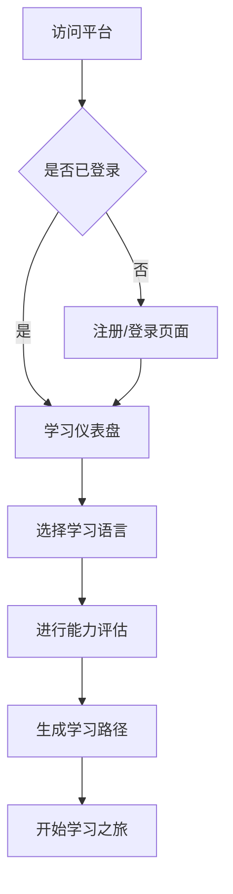
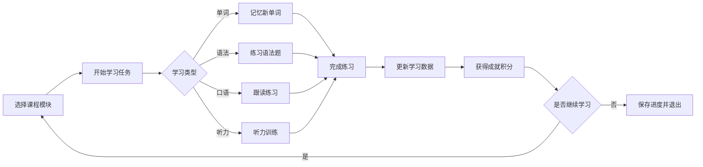
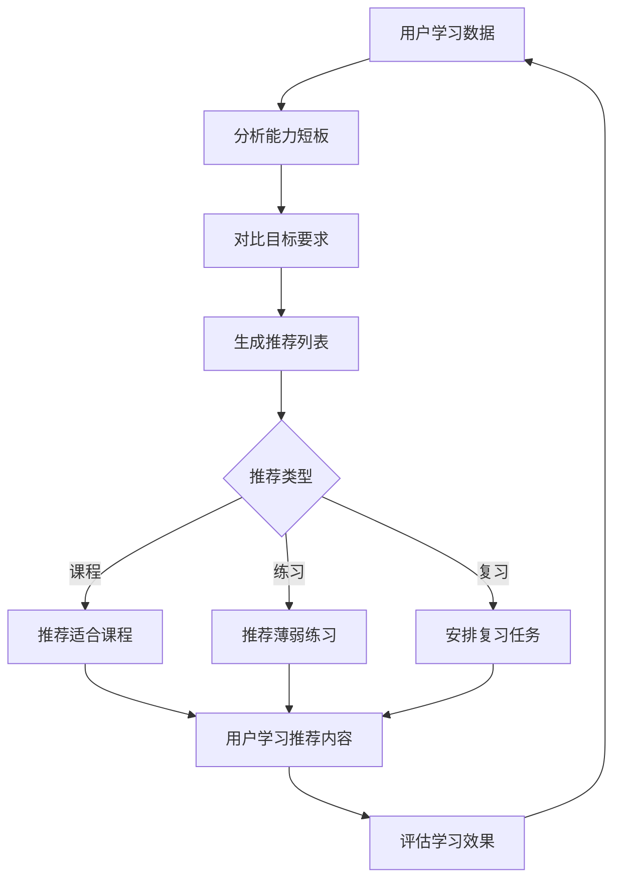

# 多语种在线教育平台 - 产品需求文档

## 1. 产品概述

LinguaFlow 是一款沉浸式多语种在线学习平台，支持英语、日语、韩语等主流语言的学习。平台通过智能化分级课程体系、互动式学习模块和个性化学习路径推荐，为用户打造专业、有趣的语言学习体验。

### 主要目标用户
- 有外语学习需求的成年人（18-45岁）
- 希望提升职场竞争力的职场人士
- 对日韩文化感兴趣的二次元爱好者和追剧党
- 准备留学或移民的语言学习者

### 核心价值主张
- 游戏化学习体验，让坚持学习成为习惯
- AI驱动的个性化推荐，告别盲目学习
- 沉浸式语言环境，真实场景对话练习

## 2. 核心功能模块

### 2.1 用户角色定义

| 角色 | 注册方式 | 核心权限 |
|------|----------|----------|
| 游客 | 无需注册 | 浏览平台介绍、免费试用课程 |
| 注册用户 | 邮箱/手机号注册 | 完整学习功能、进度追踪、社区互动 |
| 会员用户 | 付费升级 | 高级课程、AI口语陪练、一对一辅导 |

### 2.2 功能模块总览

1. **首页/仪表盘** - 学习概览、快速入口、每日目标
2. **课程中心** - 分级课程浏览、语言选择、课程详情
3. **学习模块** - 单词记忆、语法练习、口语跟读、听力训练
4. **学习进度** - 个人数据统计、能力雷达图、学习日历
5. **个性化推荐** - 智能学习路径、薄弱点分析、推荐课程
6. **社区中心** - 学习小组、话题讨论、学习伙伴匹配
7. **成就中心** - 徽章收集、排行榜、连续打卡记录
8. **用户中心** - 个人资料、设置、会员管理

### 2.3 页面功能详情

#### 首页/学习仪表盘
- **今日学习卡片**: 显示今日学习时长、完成任务数、连续打卡天数
- **继续学习入口**: 快速进入上次学习的课程模块
- **每日目标进度**: 环形进度条展示今日目标完成度
- **个性化推荐区**: 基于学习历史推荐下一阶段课程
- **学习成就展示**: 展示最新获得的徽章和里程碑

#### 课程中心页面
- **语言切换器**: 顶部标签页切换英语/日语/韩语
- **难度等级导航**: A1-C2 等级筛选（CEFR标准）
- **课程卡片列表**: 展示课程封面、标题、难度、学习人数
- **课程详情弹窗**: 课程大纲、试听内容、加入学习按钮

#### 学习模块页面
##### 单词记忆模块
- **单词卡片翻转**: 正面显示单词，点击翻转显示释义和例句
- **间隔重复算法**: 基于艾宾浩斯遗忘曲线安排复习
- **拼写练习**: 输入框练习单词拼写
- **学习统计**: 显示今日新学单词数、复习单词数、正确率

##### 语法练习模块
- **选择题模式**: 选出正确的语法填空答案
- **填空题模式**: 输入正确的语法形式
- **错题本**: 自动收集错题供后续复习
- **语法解析**: 详细的语法规则解释和例句

##### 口语跟读模块
- **跟读示范**: 播放标准发音，可调节语速
- **录音对比**: 录下用户发音并可视化对比波形
- **AI评分**: 从流利度、发音准确度打分
- **场景对话**: 模拟真实场景的对话练习

##### 听力训练模块
- **泛听模式**: 播放音频材料，可调节播放速度
- **精听模式**: 听写练习，逐句填空
- **听力测验**: 选择题测试对音频内容的理解
- **语速渐进**: 从0.75x开始逐步提升到正常语速

#### 学习进度页面
- **能力雷达图**: 展示听说读写四项能力值
- **学习曲线图**: 展示学习时长和效果的周趋势
- **学习日历**: 热力图展示每日学习情况
- **能力成长轨迹**: 记录各项能力的提升历程

#### 个性化推荐页面
- **能力评估测试**: 入门前的水平测试
- **学习路径图**: 可视化展示学习路线和当前位置
- **薄弱点分析**: 基于练习数据识别需要加强的领域
- **智能推荐列表**: 根据能力和目标推荐最适合的课程

#### 社区中心页面
- **话题广场**: 按语言和话题分类的讨论区
- **学习小组**: 组建或加入学习小组
- **学习伙伴匹配**: 基于学习目标和进度的伙伴推荐
- **发帖互动**: 发帖、回复、点赞、收藏

#### 成就中心页面
- **徽章墙**: 展示所有已获得和未解锁的徽章
- **排行榜**: 学习时长、连续天数、积分排名
- **成就动画**: 获得成就时的特效动画
- **里程碑庆祝**: 达成重要里程碑时的庆祝页面

## 3. 核心流程设计

### 3.1 用户注册登录流程

### 3.2 学习流程

### 3.3 个性化推荐流程

## 4. 用户界面设计

### 4.1 设计风格

**设计理念**: 融合东西方美学，打造「书卷气」与「科技感」并存的沉浸式学习空间

**主色调方案**:
- **主色**: 深靛蓝 #1a1f36 - 沉稳专业，象征知识的深度
- **辅助色**:
  - 碧绿 #10b981 - 成长的活力
  - 琥珀 #f59e0b - 成就的荣光
  - 玫红 #ec4899 - 语言的热情
- **渐变方案**: 主色到辅助色渐变，代表不同语言的文化融合
- **背景色**: 浅灰白 #f8fafc，渐变至淡紫 #faf5ff

**字体方案**:
- **标题字体**: Noto Serif SC (思源宋体) - 东方韵味，文化底蕴
- **正文字体**: Noto Sans SC (思源黑体) - 清晰易读，现代简洁
- **数字字体**: DM Sans - 时尚的数据展示

**按钮风格**:
- 圆角胶囊形状 (border-radius: 9999px)
- 微妙的阴影效果
- 悬停时有柔和的发光效果
- 激活状态有微缩放动画

**布局风格**:
- 卡片式布局，信息模块化
- 左侧固定导航栏 + 右侧内容区
- 响应式设计，移动端底部导航栏
- 大量留白，呼吸感强

**图标风格**:
- 使用 Lucide 图标库
- 统一的 2px 描边
- 与品牌色调一致

### 4.2 交互动效设计

**页面过渡**:
- 淡入淡出 + 轻微上滑，400ms ease-out
- 页面切换有流畅的滑动效果

**交互反馈**:
- 按钮悬停: scale(1.02) + 阴影加深
- 卡片悬停: translateY(-4px) + 阴影加深
- 点击反馈: scale(0.98) 快速回弹
- 加载状态: 优雅的骨架屏 + 脉冲动画

**成就系统动画**:
- 徽章解锁: 光芒四射 + 金币飞散效果
- 连续打卡: 日历翻页动画
- 等级提升: 成长进度条 + 特效

**学习模块动画**:
- 单词翻转: 3D 翻书效果
- 答对题目: 绿色对勾 + 轻微弹跳
- 答错题目: 红色提示 + 轻微抖动

### 4.3 页面设计详情

#### 首页/仪表盘
| 模块 | 设计风格 | 布局 |
|------|----------|------|
| 顶部导航栏 | 深色半透明毛玻璃效果 | 固定定位，Logo居中 |
| 今日学习卡片 | 渐变卡片，阴影悬浮感 | 占据主要视觉焦点 |
| 继续学习区 | 水平滚动的课程卡片 | 3张可见，卡片式设计 |
| 推荐课程区 | 左右箭头切换的轮播 | 卡片带有语言标识色 |
| 成就展示区 | 徽章墙预览，点击展开 | 网格布局，3x3展示 |

#### 课程中心
| 模块 | 设计风格 | 布局 |
|------|----------|------|
| 语言切换标签 | 底部有彩色指示条 | 三个等宽标签 |
| 难度筛选器 | 圆角药片式按钮组 | 横向排列 |
| 课程卡片 | 封面图 + 渐变遮罩 | 网格布局 2x3 |
| 悬浮预览 | 课程卡片悬停展开详情 | 覆盖层效果 |

#### 学习模块
| 模块 | 设计风格 | 布局 |
|------|----------|------|
| 单词卡片 | 大尺寸圆角卡片，居中 | 垂直居中布局 |
| 进度指示 | 顶部细长进度条 | 固定顶部 |
| 操作按钮 | 底部大尺寸操作区 | 拇指友好设计 |

### 4.4 响应式设计

- **桌面端 (≥1280px)**: 左侧导航栏 + 主内容区
- **平板端 (768-1279px)**: 折叠式导航栏 + 全宽内容区
- **移动端 (<768px)**: 底部Tab导航 + 全屏内容区
- 触摸交互优化，按钮最小点击区域 44x44px

### 4.5 辅助功能

- 深色模式切换
- 字体大小调节 (小/中/大)
- 键盘快捷键支持
- 屏幕阅读器友好
- 高对比度模式

## 5. 产品数据埋点

### 关键指标
- **DAU/MAU**: 日活和月活用户数
- **学习完成率**: 各模块任务完成百分比
- **平均学习时长**: 每用户每日平均学习时长
- **7日留存率**: 新用户7日留存
- **课程完成率**: 付费课程的完成比例
- **转化率**: 免费用户到付费用户的转化

### 埋点事件
- 用户注册/登录
- 课程开始/完成
- 练习答题正确/错误
- 成就解锁
- 社区发帖/回复
- 页面停留时长
